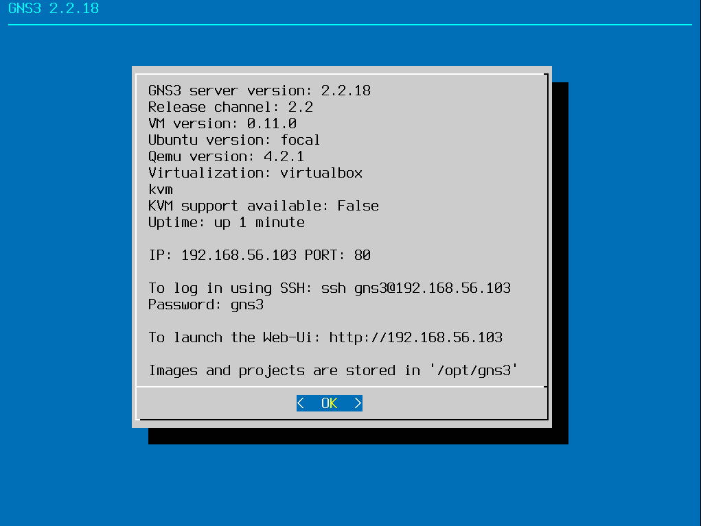
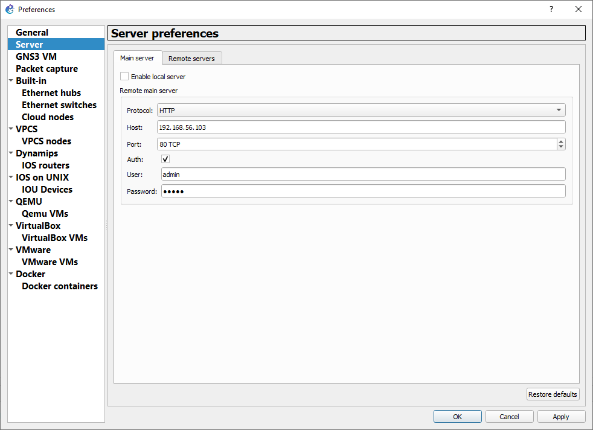
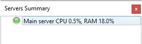

# KIV/PSI - Computer Networks

## Introduction

This Git repo contains supplementary examples for the subject "Computer Networks" taught at the [Department of Computer Science and Engineering](http://www.kiv.zcu.cz/), University of West Bohemia, Czech Republic

## Software prerequisites

In order to be able to run the provided examples, it is necessary to have the following software installed on your machine:

* [Git](https://git-scm.com/)
* [VirtualBox](https://www.virtualbox.org/)
* [Vagrant](https://www.vagrantup.com/)
* [GNS3](https://www.gns3.com/)

Git, VirtualBox and Vagrant are pretty easy to install and some of them maybe already present on your system.

In the case of GNS3 it is better to bring up the GNS3 virtual machine and then install the GNS3 software:

1. Download the [GNS3 VM for VirtualBox](https://www.gns3.com/software/download-vm)
2. Unpack the archive and import the virtual appliance. If there is any issue with the network interface of the appliance, then choose the host network with DHCP enabled (see Host Network Manager in VirtualBox).
3. Start the VM and after the machine boots up you should see the following screen:



4. Now you are ready to install GNS3. Use the provided defaults during the installation, **choose not to install the GNS3 VM**.
5. After a successful installation start GNS3 and configure it to connect to the running VM:



6. Provide the server parameters as shown on the VM screen and confirm the preferences. It will take some time, until the UI can talk to the server. If everything went well, you should see your server in Server's summary:



The GNS3 software architecture is pretty flexible, you can connect to several server and it has even a Web UI!

```
+---------------+                  +----------+     +------+
|               |                  | COMPUTE  +-----> QEMU |
|  GNS3 GUI     |              +---> SERVER 1 |     +------+
|  QT interface +-----+        |   +----------+
|               |     |        |                    +---+
+---------------+    +v--------++               +--->IOU|
                     |CONTROLLER|               |   +---+
      +---------+    +^--------++  +---------+  |
      | GNS3 WEB+-----+        |   | COMPUTE +--+
      +---------+              +---> SERVER 2+--+   +--------+
                                   +---------+  +--->DYNAMIPS|
                                                    +--------+
```

